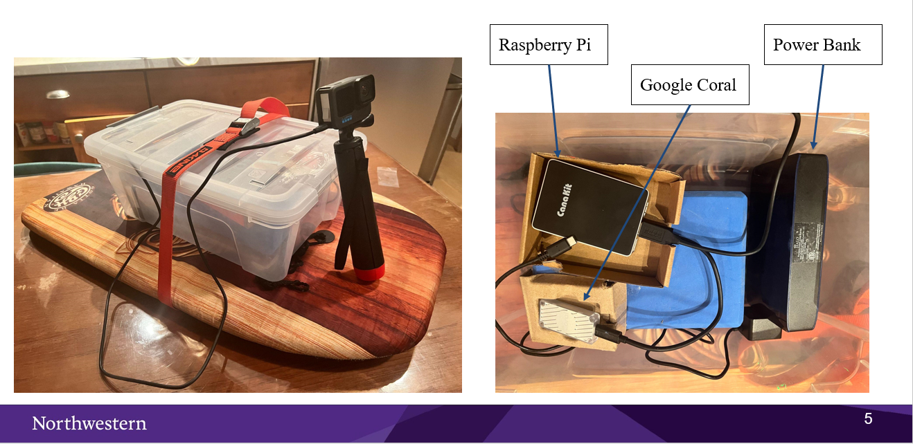

This file serves as documentation for what I did on my project, and how you might go about replicating it. It will also explain the other materials uploaded in this folder.

There are two videos, two zipped folders, and one powerpoint file:

Videos:
	- Demo is a demonstration of the program running live on the hardware. The experiment is meant to 	simulate real use.
	- Presentation is a walkthrough of the Powerpoint summary with commentary.
Folders:
	-One is for training a comparable model from scratch, code and data.
	-One is the supplemental files needed to run the compiled model on the Raspi/Google Coral
Powerpoint:
	-The aforementioned executive summary of the project.

Training:
To train the model from scratch unzip the "TrainingCodeandData" folder into one called "TrainData" then upload that whole to your google drive. The code files are in the same directory as the images, easy to miss.

My process followed Detlef Heinzes fixed version of the Google issued Coral/Object Detection tutorial. These are both linked on slide 7 of the presentation. 

In your TrainData directory:
-Fish image data
-convert.ipynb is a jupyter notebook with useful functions relevant to preprocessing training data and annotations.
-Copy of trainSMRC.ipynb is a jupyter notebook that is an abridged version of Detlef's work, and is the command center for training your model. 
-train.py is the python script that actually does the training, it's called by Copy of trainSMRC.ipynb.
-training.csv is the csv file of annotations/bounding boxes for the fish images. 

If you want to use your own data, there are a few steps. Delete all fish images, and training.csv. You have to install LabelImg and use that to create Pascal VOC annotations for your image set. Then use the functions in convert.ipynb locally to convert those annotations to a csv file. Then upload the new images and training.csv. Then follow the logic/processes laid out in trainSMRC.ipynb. You can also change the pretrained model you use by editing train.py accordingly. Keep in mind, you have to download it, edit locally, then reupload because there is no way to edit python files in your Google Drive directly. 

All this being said you can skip ahead to just running the model as I have compiled it if you wish. 

To do this first start by making a virtual environment for Python 3.9.0. You can follow any number of tutorials online. Then start following these instructions to set up your Raspberry Pi and Google Coral: https://coral.ai/docs/accelerator/get-started/#1-install-the-edge-tpu-runtime

Once you get to step two (Installing PyCoral library) however, pause because the Linux code it gives you will most likely not work. You will have to download the whl's directly from https://github.com/google-coral/pycoral/releases. and for both the TF-Lite runtime and the pycoral runtime. This depends on your python version and you Raspi architecture. So for me it was:

`wget https://github.com/google-coral/pycoral/releases/download/v2.0.0/tflite_runtime-2.5.0.post1-cp39-cp39-linux_aarch64.whl`

`wget https://github.com/google-coral/pycoral/releases/download/v2.0.0/pycoral-2.0.0-cp39-cp39-linux_aarch64.whl`

The pip install:

`pip install tflite_runtime-2.5.0.post1-cp39-cp39-linux_aarch64.whl`

`pip install pycoral-2.0.0-cp39-cp39-linux_aarch64.whl`

Make sure all of that was done in the virtual environment you set up. 

Then continue to follow the instructions and stop after you have completed the first stage of step 3 (Run a model on the Edge TUP > Download the example code from Github).You should now have a new directory coral > pycoral. After that unzip the runningmodel folder. Place all of the files into pycoral. 

There should be three python files, each one of them pertains to a different action taken with the GoPro over usb with their API. Their documentation is badly organized but this is the address for the most focused documentation on commands over usb if needed to alter or further understand: https://gopro.github.io/OpenGoPro/http

Then there is a tflite file and a text file. These are the pertinent to the trained model that gets used to make inferences. So if you did end up training your own model, replaces these files with the equivalent ones from when you compiled your model.

Lastly there is the continuous_detection.sh file. Running this starts the routine of having the GoPro get images and then run object detection inferences on them based on the compiled tflite model. Plug in GoPro before running. 

But before you run check the .sh file. Line 8 is the line that actually runs the inference, and it takes a few arguments. If you trained your own model, make sure that the names for the .tflite file and .txt file are updated. You can also selectively alter other args, like the threshold for a noted detection and the number of inferences ran per image. 

When that is set you're all set to run. Make sure you are in your virtual environment and the right directory:

`source myenv/bin/activate`

`cd coral/pycoral`

Turn the .sh file into an executable:

`chmod +x continuous_detection.sh`

And run the executable:

`./continuous_detection.sh`

And thats it! The program should start looping/running and you can hit Ctrl+C at any time to interrupt it. Happy Detecting!

